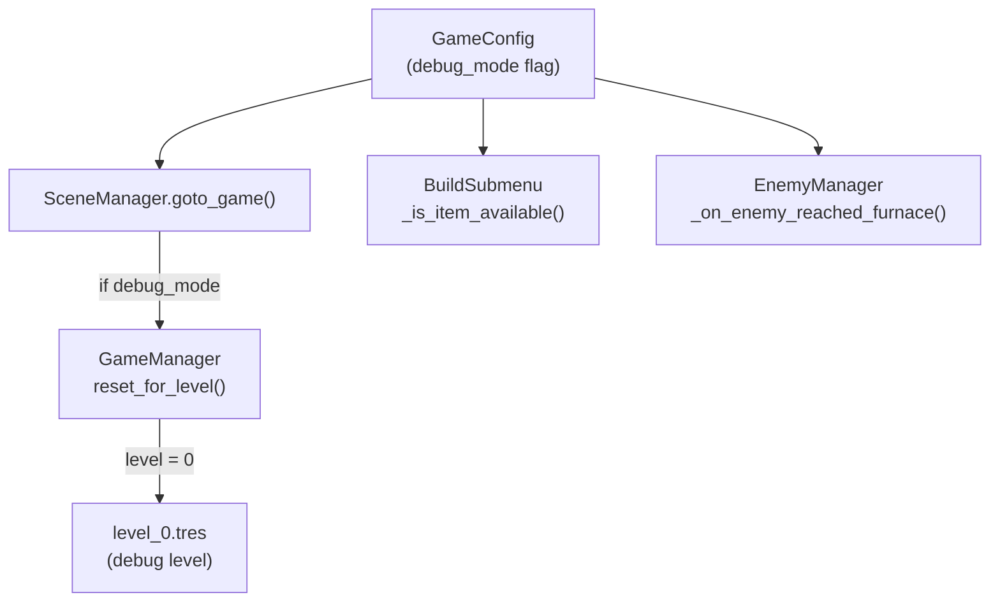

# Debug Level System

## Overview

Create a developer-focused debug mode that bypasses normal level progression for testing mechanics. This is controlled by a single flag in `GameConfig` (default off) and loads a special "Level 0" test level.

## Architecture



## Changes Required

### 1. Add debug flag to GameConfig

File: [`godot/scripts/autoload/game_config.gd`](godot/scripts/autoload/game_config.gd)

Add a new variable at the top of the file:

```gdscript
## Developer debug mode - when true, starts at debug level with all items unlocked
## Set to true in editor for testing, leave false for production
var debug_mode: bool = false
```

Add level 0 resources to the `level_resources` array:

```gdscript
var level_resources: Array[int] = [
    1000, # Level 0 (debug) - generous resources for testing
    100,  # Level 1 - Tutorial
    ...
]
```

### 2. Create debug level resource

File: `godot/resources/levels/level_0.tres` (new file)

Create a LevelData resource with:

- `level_number = 0`
- `level_name = "Debug Level"`
- `starting_resources = 1000`
- `allowed_runes = []` (empty = all runes with `unlocked_by_default` available)
- Simple enemy wave for basic testing
- Standard spawn point and furnace position

### 3. Modify SceneManager to load debug level

File: [`godot/scripts/autoload/scene_manager.gd`](godot/scripts/autoload/scene_manager.gd)

Modify `goto_game()` to check debug mode:

```gdscript
func goto_game() -> void:
    if GameConfig.debug_mode:
        GameManager.current_level = 0
    get_tree().change_scene_to_file(GAME_SCENE)
```

### 4. Modify BuildSubmenu to unlock all items in debug mode

File: [`godot/scripts/ui/build_submenu.gd`](godot/scripts/ui/build_submenu.gd)

Modify `_is_item_available()` to bypass unlock checks in debug mode:

```gdscript
func _is_item_available(definition: Resource) -> bool:
    if not definition:
        return false

    # Debug mode: all items available
    if GameConfig.debug_mode:
        return true

    # ... existing logic
```

### 5. Disable furnace destruction in debug mode

File: [`godot/scripts/autoload/enemy_manager.gd`](godot/scripts/autoload/enemy_manager.gd)

Modify `_on_enemy_reached_furnace()` to skip game over in debug mode:

```gdscript
func _on_enemy_reached_furnace(enemy: EnemyBase) -> void:
    enemy_reached_furnace.emit(enemy)

    # In debug mode, don't end the game when enemies reach furnace
    if GameConfig.debug_mode:
        print("EnemyManager: [DEBUG] Enemy reached furnace - ignoring (debug mode)")
        # Remove enemy from tracking so win condition can still trigger
        var index := active_enemies.find(enemy)
        if index >= 0:
            active_enemies.remove_at(index)
        _check_win_condition()
        return

    furnace_destroyed.emit()
    print("EnemyManager: Enemy reached furnace - GAME OVER")
```

## How to Enable Debug Mode

Developers can enable debug mode by:

1. Opening [`godot/scripts/autoload/game_config.gd`](godot/scripts/autoload/game_config.gd)
2. Setting `debug_mode = true`
3. Running the game - it will start at Level 0 with all items and invincibility

Note: The flag defaults to `false` so it won't affect production builds or other developers unless explicitly enabled.

## Test Plan

After implementation:

1. Set `debug_mode = true` in GameConfig
2. Start the game - should load "Debug Level" (Level 0)
3. Verify 1000 starting resources shown
4. Verify all runes appear in build menu (including normally locked ones)
5. Let an enemy reach the furnace - game should NOT end
6. Kill all enemies - game should still show victory