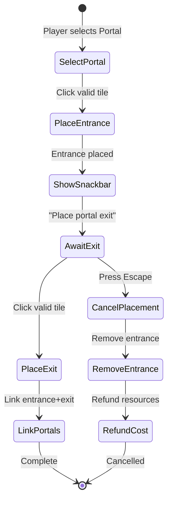

# Fireball and Rune Interaction System

## Overview

Update fireball collision behavior and implement new rune types to complete the MVP rune system. The fireball will now destroy on walls/edges (instead of bouncing), requiring players to use the new Reflect Rune for bouncing behavior.

---

## 1. Fireball Behavior Changes

**File**: [godot/scripts/entities/fireball.gd](godot/scripts/entities/fireball.gd)

**Current behavior** (lines 40-51):

- Bounces at grid edges (`_bounce()`)
- Bounces at walls (`_bounce()`)

**New behavior**:

- Edge of map: Call `_destroy()` instead of `_bounce()`
- Wall collision: Call `_destroy()` instead of `_bounce()`
- Add `teleport_to(position: Vector2, new_direction: Vector2)` method for portal support
- Add `reflect()` method (180-degree turn) for Reflect Rune to call

---

## 2. Reflect Rune Implementation

**New File**: `godot/scripts/entities/runes/reflect_rune.gd`

- Extends `RuneBase`
- On activation: calls `fireball.reflect()` (180-degree direction reversal)
- Uses `uses_remaining` from base class for limited uses
- Add cooldown/debounce to prevent stuck bouncing (configurable via `GameConfig`)

**Scene**: `godot/scenes/entities/runes/reflect_rune.tscn`

**Update**: [godot/resources/buildable_items/reflect_rune_definition.tres](godot/resources/buildable_items/reflect_rune_definition.tres) - add `scene_path`

---

## 3. Explosive Rune Implementation

**New File**: `godot/scripts/entities/runes/explosive_rune.gd`

- Extends `RuneBase`
- On activation: damage all enemies on the SAME tile (not adjacent)
- Damage value from `GameConfig.explosive_rune_damage`
- Play VFX/SFX on activation
- Single use (consumes after activation)

**Scene**: `godot/scenes/entities/runes/explosive_rune.tscn`

**Update**: `godot/resources/buildable_items/explosive_rune_definition.tres` - add `scene_path`

---

## 4. Advanced Redirect Rune

**New File**: `godot/scripts/entities/runes/advanced_redirect_rune.gd`

- Extends `RedirectRune` (inherits direction behavior)
- Override `rune_type = "advanced_redirect"`
- Add `is_editable_in_active_phase: bool = true` property
- Must be distinguishable from regular redirect for UI to allow active-phase editing

**UI Integration**:

- [godot/scripts/ui/tile_tooltip.gd](godot/scripts/ui/tile_tooltip.gd) already has direction controls
- [godot/scripts/game/game_scene.gd](godot/scripts/game/game_scene.gd) needs to allow tooltip during ACTIVE_PHASE for advanced redirect tiles only

**Scene**: `godot/scenes/entities/runes/advanced_redirect_rune.tscn` (or reuse redirect scene with different script)

---

## 5. Portal System Implementation

### 5.1 Portal Runes

**New Files**:

- `godot/scripts/entities/runes/portal_rune.gd` - Base portal class
  - `is_entrance: bool` - true for entrance, false for exit
  - `linked_portal: PortalRune` - reference to paired portal
  - `direction: Direction` - both entrance and exit have direction
  - Entrance: only activates when fireball enters from configured direction
  - Exit: fireball exits in configured direction

**Scenes**:

- `godot/scenes/entities/runes/portal_entrance.tscn`
- `godot/scenes/entities/runes/portal_exit.tscn`

### 5.2 Portal Placement Flow



**Files to modify**:

- [godot/scripts/game/placement_manager.gd](godot/scripts/game/placement_manager.gd):

  - Add portal placement state machine
  - Track `pending_portal_entrance: Node2D`
  - Add `portal_placement_mode: bool`
  - Handle escape to cancel portal placement
  - Link entrance/exit on completion

- [godot/scripts/game/game_scene.gd](godot/scripts/game/game_scene.gd):
  - Create snackbar/toast component for "Place portal exit" message
  - Handle portal cancellation via escape key

### 5.3 BuildableItemDefinition Update

**File**: [godot/scripts/resources/buildable_item_definition.gd](godot/scripts/resources/buildable_item_definition.gd)

Add new property:

```gdscript
@export var requires_paired_placement: bool = false  # For portal
```

---

## 6. GameConfig Updates

**File**: [godot/scripts/autoload/game_config.gd](godot/scripts/autoload/game_config.gd)

Add constants:

- `explosive_rune_damage: int = 10`
- `reflect_rune_cooldown: float = 0.5` (seconds between activations)

---

## 7. Definition File Updates

Update these `.tres` files to add `scene_path` and `has_direction`:

| File | scene_path | has_direction |

| -------------------------------- | -------------------------------------------------- | ------------- |

| `reflect_rune_definition.tres` | `res://scenes/entities/runes/reflect_rune.tscn` | false |

| `explosive_rune_definition.tres` | `res://scenes/entities/runes/explosive_rune.tscn` | false |

| `portal_rune_definition.tres` | `res://scenes/entities/runes/portal_entrance.tscn` | true |

---

## Implementation Order

1. **Fireball changes** - Update collision behavior (destroy instead of bounce)
2. **Reflect Rune** - Restore bounce capability as an item
3. **Explosive Rune** - Simple damage rune
4. **Advanced Redirect** - Extend existing redirect
5. **Portal System** - Most complex, requires placement flow changes
6. **UI Polish** - Snackbar, active-phase tooltip for advanced redirect
