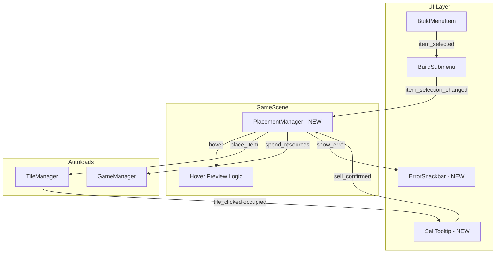

# Build Menu System Implementation

## Current State Analysis

The project has foundational systems in place but lacks the interactive placement mechanics:

**Existing:**

- `BuildableItemDefinition` resource with cost, scene_path, icon_color
- 7 buildable items defined in [godot/resources/buildable_items](godot/resources/buildable_items)
- `GameManager` with `spend_resources()`, `add_resources()`, `resources_changed` signal
- `build_submenu.gd` populates menu items and emits `item_selected` signal (but does nothing with it)
- Basic hover highlight in `game_scene.gd`

**Missing:**

- Selection state tracking (highlighted item in menu)
- Placement preview on tiles (50% opacity ghost)
- Valid/invalid placement indicators (green/red overlays)
- Click-to-place and drag-and-drop placement logic
- Sell modal/tooltip for occupied tiles
- Error snackbar for failed placements
- Start button is broken (wrong node path in game_scene.gd)
- Money display not updating correctly

---

## Architecture Overview



---

## Implementation Tasks

### 1. Fix Starting Money Configuration

Update [godot/scripts/autoload/game_config.gd](godot/scripts/autoload/game_config.gd) level_resources array:

```gdscript
var level_resources: Array[int] = [
    0,    # Level 0 (unused)
    420,  # Level 1 - Tutorial (was 100)
    # ... keep other levels
]
```

### 2. Fix Game Submenu UI Structure

The current [godot/scenes/ui/game_submenu.tscn](godot/scenes/ui/game_submenu.tscn) has node paths that don't match what `game_scene.gd` expects. Refactor to use proper named nodes with unique names for StatsContainer, LevelValue, MoneyValue, and StartButton that game_scene.gd can find.

### 3. Create PlacementManager System

New file: `godot/scripts/game/placement_manager.gd`

Responsibilities:

- Track currently selected buildable item (or null)
- Handle tile hover preview (ghost at 50% opacity)
- Validate placement (tile empty, has money)
- Execute placement (instantiate scene, deduct money, update tile)
- Handle sell requests (refund money, clear tile)
- Emit signals for UI feedback

Key signals:

- `item_selection_changed(item_type: String)` - when player selects/deselects menu item
- `placement_failed(reason: String)` - for error snackbar
- `placement_succeeded(item_type: String, grid_pos: Vector2i)`

### 4. Enhance BuildMenuItem for Selection State

Update [godot/scripts/ui/build_menu_item.gd](godot/scripts/ui/build_menu_item.gd):

- Add `is_selected: bool` state with visual indicator (border highlight)
- Track drag state for drag-and-drop
- Implement `_get_drag_data()` for drag support
- Add method `set_selected(selected: bool)` to toggle highlight

### 5. Enhance BuildSubmenu for Selection Management

Update [godot/scripts/ui/build_submenu.gd](godot/scripts/ui/build_submenu.gd):

- Track `selected_item_type: String`
- When item clicked: if same item, deselect; if different, select new
- Emit signal to PlacementManager
- Handle Escape key to cancel selection
- Add `_can_drop_data()` and `_drop_data()` for drag-and-drop

### 6. Enhance Tile Hover Feedback

Update [godot/scripts/game/game_scene.gd](godot/scripts/game/game_scene.gd) `_update_hover_highlight()`:

- When item selected AND hovering tile:
  - If buildable: green overlay + ghost preview of item at 50% opacity
  - If not buildable: red overlay, no preview
- When dragging item: same hover behavior

### 7. Create Sell Tooltip/Modal

New scene: `godot/scenes/ui/sell_tooltip.tscn`

New script: `godot/scripts/ui/sell_tooltip.gd`

Features:

- Appears above clicked tile when tile has player-placed item
- Shows item name and "Sell for $X" button
- Dismisses on click elsewhere or after selling
- Checks `is_player_placed` flag on tile to prevent selling presets

### 8. Create Error Snackbar

New scene: `godot/scenes/ui/error_snackbar.tscn`

New script: `godot/scripts/ui/error_snackbar.gd`

Features:

- Auto-hide after 2-3 seconds
- Shows error message (e.g., "Not enough money!", "Tile occupied!")
- Positioned at bottom of screen

### 9. Track Player-Placed vs Preset Items

Update [godot/scripts/tiles/tile_base.gd](godot/scripts/tiles/tile_base.gd):

- Add `is_player_placed: bool = false` property
- Set to `true` when player places item, `false` for preset items
- Use this flag to determine if sell button should appear

### 10. Wire Click-to-Place Logic

In `game_scene.gd`, handle tile clicks:

- If no item selected AND tile has player-placed item: show sell tooltip
- If item selected AND tile buildable: attempt placement
- If item selected AND tile not buildable: show error

### 11. Wire Drag-and-Drop Logic

Implement Godot drag-and-drop:

- `BuildMenuItem._get_drag_data()`: return item_type and create drag preview
- `game_scene.gd._can_drop_data()`: check if target tile is buildable
- `game_scene.gd._drop_data()`: execute placement

### 12. Currency Change Animation

Add subtle animation to the money display in GameSubmenu when currency changes:

- **On spend (decrease)**: Brief red flash/pulse, scale down slightly then back
- **On gain (refund)**: Brief green flash/pulse, scale up slightly then back
- Connect to `GameManager.resources_changed` signal
- Track previous value to determine if increase or decrease
- Use Tween for smooth animation (~0.3s duration)

Example implementation in game_submenu or a new `currency_display.gd`:

```gdscript
var previous_resources: int = 0

func _on_resources_changed(new_amount: int) -> void:
    var delta := new_amount - previous_resources
    previous_resources = new_amount
    money_label.text = "$%d" % new_amount
    _animate_currency_change(delta)

func _animate_currency_change(delta: int) -> void:
    var tween := create_tween()
    var flash_color := Color.GREEN if delta > 0 else Color.RED
    
    # Flash color
    tween.tween_property(money_label, "modulate", flash_color, 0.1)
    tween.tween_property(money_label, "modulate", Color.WHITE, 0.2)
    
    # Scale pulse
    tween.parallel().tween_property(money_label, "scale", Vector2(1.15, 1.15), 0.1)
    tween.tween_property(money_label, "scale", Vector2(1.0, 1.0), 0.2).set_ease(Tween.EASE_OUT)
```

---

## File Changes Summary

| File | Action | Description |

| ------------------------- | ------ | -------------------------------------------------- |

| `game_config.gd` | Modify | Change level 1 resources to 420 |

| `game_scene.gd` | Modify | Add placement logic, fix node paths, enhance hover |

| `tile_base.gd` | Modify | Add `is_player_placed` flag |

| `tile_manager.gd` | Modify | Add `clear_tile()` method for selling |

| `build_menu_item.gd` | Modify | Add selection state, drag support |

| `build_submenu.gd` | Modify | Add selection tracking, emit signals |

| `game_submenu.tscn` | Modify | Fix node structure for game_scene.gd |

| `game_submenu.gd` | Create | Script for currency animation and submenu logic |

| `placement_manager.gd` | Create | Central placement logic |

| `sell_tooltip.tscn/.gd` | Create | Sell UI component |

| `error_snackbar.tscn/.gd` | Create | Error feedback component |

---

## Key Design Decisions

1. **PlacementManager as scene child, not autoload**: Keeps placement logic scoped to game_scene, avoids global state pollution

2. **Ghost preview as temporary Node2D**: Instantiate preview from scene_path, set modulate alpha to 0.5, destroy on hover exit

3. **Sell tooltip positions above tile**: Use `get_global_transform()` of tile to position tooltip in screen space

4. **Full refund (100%)**: As per UI_DESIGN.md and your confirmation

5. **Only player-placed items sellable**: Tracked via `is_player_placed` flag on TileBase