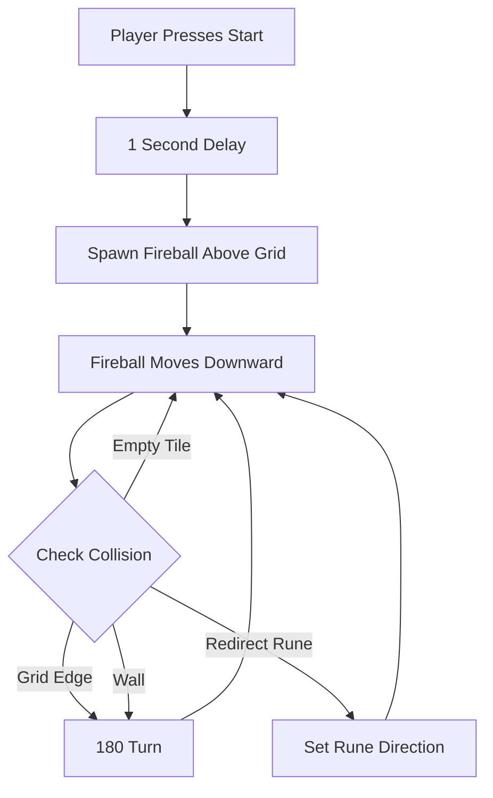
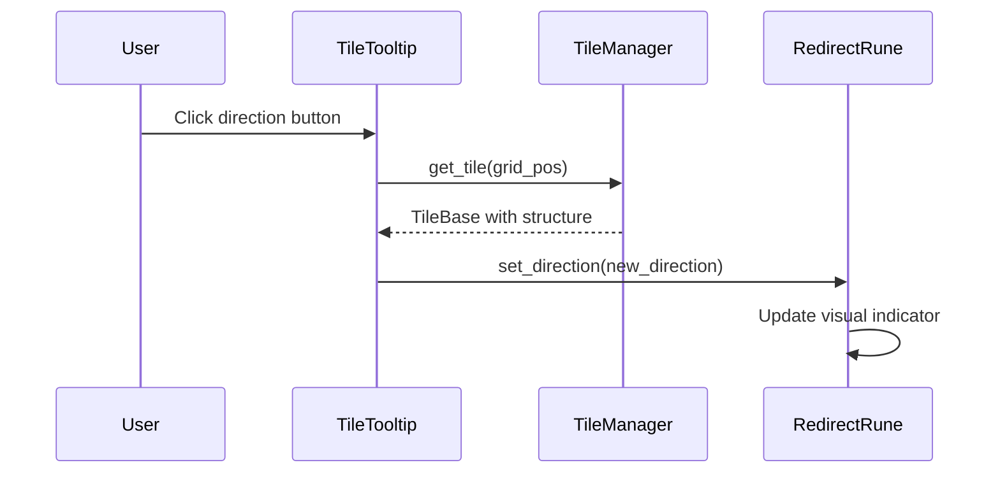

# Fireball System Implementation

## Current State

- `fireball.gd` has basic movement, direction, and tile activation logic
- `redirect_rune.gd` already changes fireball direction on activation
- `tile_tooltip.tscn` has direction buttons (Up/Down/Left/Right) but they're not wired
- `game_scene.gd` has placeholder `_launch_fireball()` function

## Architecture Overview



## Implementation Tasks

### 1. BuildableItemDefinition - Add Direction Properties

File: [`godot/scripts/resources/buildable_item_definition.gd`](godot/scripts/resources/buildable_item_definition.gd)

Add two new exported properties:

```gdscript
@export var has_direction: bool = false  # Whether this item can be rotated
@export var default_direction: String = "south"  # Default direction: "north", "south", "east", "west"
```

Update `_init()` to include these parameters.

### 2. Update Redirect Rune Definition

File: [`godot/resources/buildable_items/redirect_rune_definition.tres`](godot/resources/buildable_items/redirect_rune_definition.tres)

Set `has_direction = true` and `default_direction = "south"`.

### 3. TileTooltip - Wire Direction Buttons

File: [`godot/scripts/ui/tile_tooltip.gd`](godot/scripts/ui/tile_tooltip.gd)

- Add references to direction buttons (Up, Down, Left, Right)
- Add `direction_changed` signal
- Add `direction_buttons_container` reference to show/hide direction controls
- In `show_for_tile()`:
  - Check if the placed item has `has_direction = true`
  - Show/hide direction button container accordingly
  - Connect button signals to emit `direction_changed`
- Update rune direction when buttons are clicked

### 4. TileTooltip Scene - Unique Names for Direction Buttons

File: [`godot/scenes/ui/tile_tooltip.tscn`](godot/scenes/ui/tile_tooltip.tscn)

- Add unique names (`%UpButton`, `%DownButton`, etc.) to direction buttons
- Add a container node for direction controls to easily show/hide

### 5. Fireball - Collision Detection and Bouncing

File: [`godot/scripts/entities/fireball.gd`](godot/scripts/entities/fireball.gd)

Key changes:

- Refactor `_check_boundaries()` to bounce instead of destroy
- Add `_check_wall_collision()` to detect walls ahead
- Add `_bounce()` helper to reverse direction (180-degree turn)
- Improve `_check_tile_activation()` to detect runes, walls, and boundaries proactively (look-ahead)

Core collision logic:

```gdscript
func _physics_process(delta: float) -> void:
    if not is_active:
        return

    # Calculate next position
    var next_pos := position + direction * current_speed * delta
    var next_grid_pos := _world_to_grid(next_pos)

    # Check for boundary collision (bounce at grid edges)
    if _is_out_of_bounds(next_grid_pos):
        _bounce()
        return

    # Check for wall collision (bounce at walls)
    if _has_wall_at(next_grid_pos):
        _bounce()
        return

    # Move to next position
    position = next_pos

    # Check for tile center crossing (for rune activation)
    _check_tile_activation()

func _bounce() -> void:
    direction = -direction  # 180-degree turn
```

### 6. Game Scene - Fireball Spawning with Delay

File: [`godot/scripts/game/game_scene.gd`](godot/scripts/game/game_scene.gd)

Update `_launch_fireball()`:

```gdscript
func _launch_fireball() -> void:
    # Wait 1 second before launching
    await get_tree().create_timer(1.0).timeout

    # Spawn fireball above the furnace
    var fireball_scene := load("res://scenes/entities/fireball.tscn")
    var fireball := fireball_scene.instantiate() as Fireball

    # Calculate spawn position (above furnace tile)
    var furnace_pos := current_level_data.furnace_position
    var spawn_world_pos := Vector2(
        furnace_pos.x * GameConfig.TILE_SIZE + GameConfig.TILE_SIZE / 2.0,
        -GameConfig.TILE_SIZE / 2.0  # Above the grid
    )

    # Add to game board and launch
    game_board.add_child(fireball)
    fireball.launch(spawn_world_pos)
```

### 7. Fireball Speed Configuration

File: [`godot/scripts/autoload/game_config.gd`](godot/scripts/autoload/game_config.gd)

Current values:

- `fireball_speed = 200.0` (already 4x basic enemy speed of 50.0)

No changes needed - already at 4x enemy speed.

## Data Flow for Direction Changes



## Key Design Decisions

- Direction is stored on the rune instance (`RedirectRune.direction`), not the definition
- Bouncing is a simple 180-degree turn (reverse direction vector)
- Collision detection uses look-ahead to prevent fireball from entering walls/boundaries
- Fireball spawns above grid and enters naturally, rather than appearing on a tile
